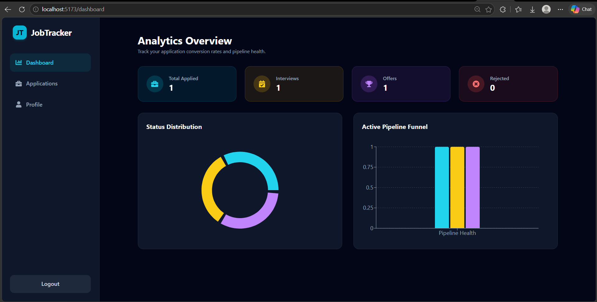
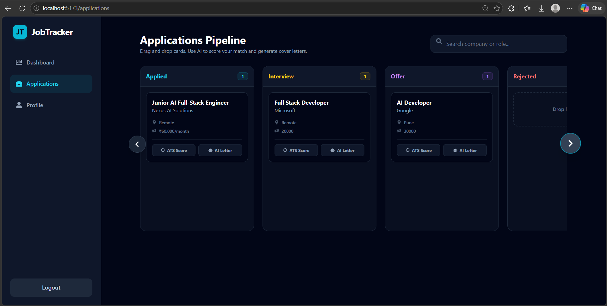
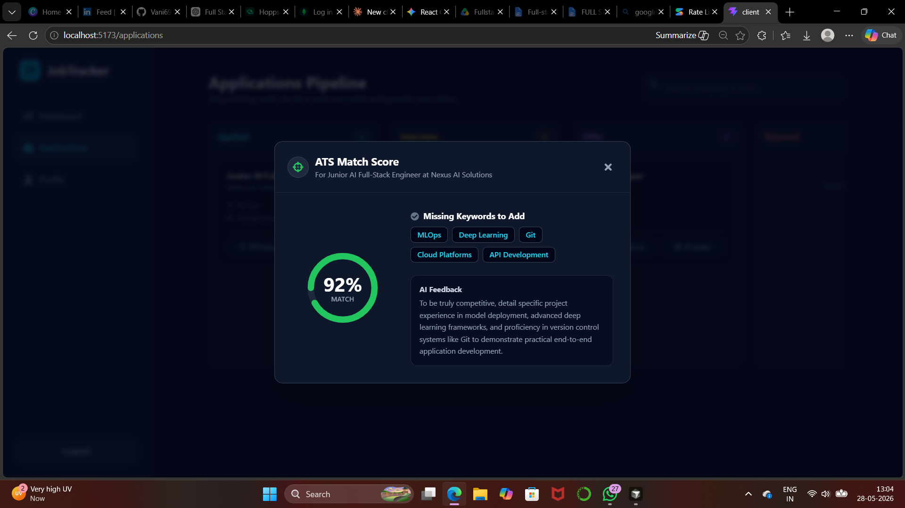
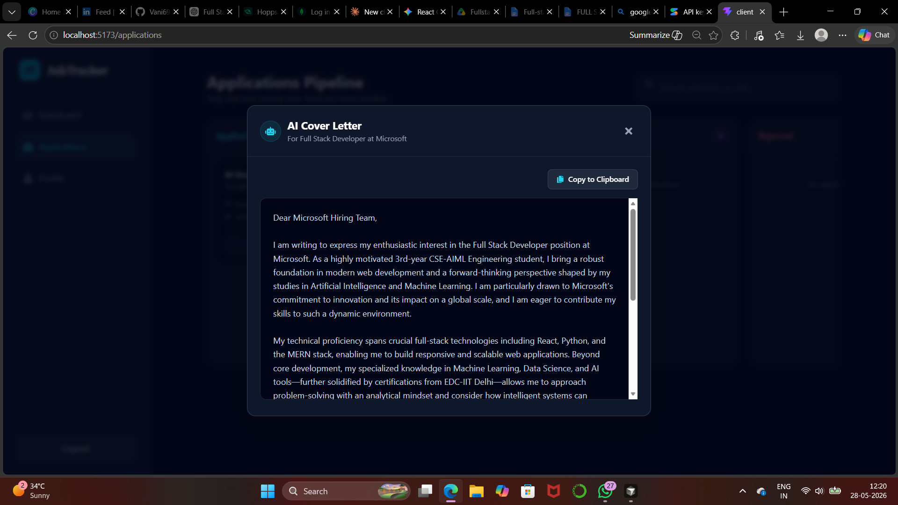
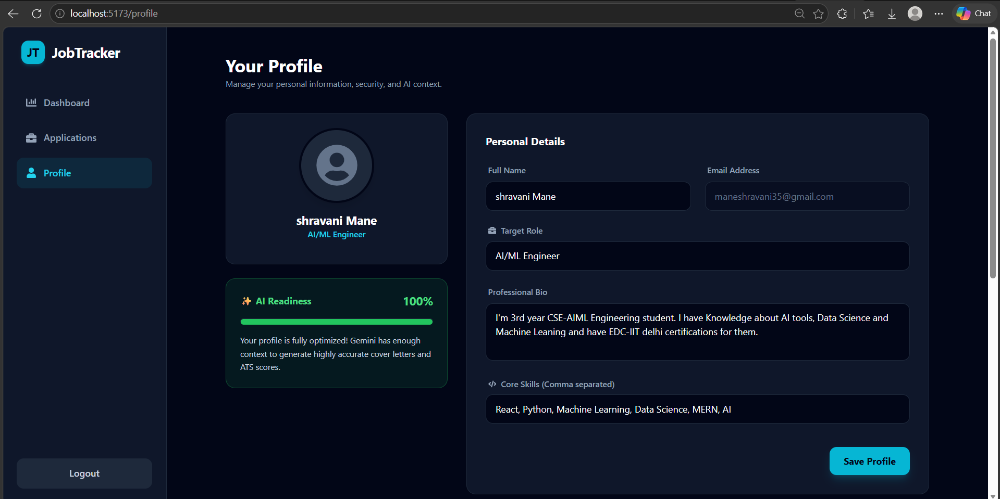

# 🚀 JobTracker AI: Intelligent Application Pipeline


A full-stack, AI-powered application tracking system designed to streamline the job hunt. JobTracker AI goes beyond simple data entry by integrating Google's Gemini LLM to automatically generate tailored cover letters and calculate real-time ATS match scores based on your technical profile.

---

## ✨ Core Features

* **Drag-and-Drop Kanban Board:** Visually manage your application pipeline (Applied, Interview, Offer, Rejected) with instant optimistic UI updates and background database syncing.
* **Intelligent ATS Scorer:** Analyzes the target job description against your saved user profile and skills, generating a match percentage, missing keywords, and actionable AI feedback.
* **One-Click Cover Letters:** Generates highly tailored, professional cover letters instantly using the Gemini 2.5 Flash model, ready to copy to your clipboard.
* **Data Analytics Dashboard:** Real-time data visualization using Recharts to track application conversion rates, pipeline health, and status distributions.
* **Secure Authentication:** JWT-based user authentication ensuring your job data and AI context remain strictly private.

---

## 🆕 Recent Updates
* **Strong Password Generator:** Added a Google-style "Suggest strong password" button to the registration flow with automatic browser credential saving.
* **Profile Photo Uploads:** Added the ability to upload a custom profile picture (saved directly to MongoDB via base64 encoding).
* **UI Bug Fix:** Fixed a critical bug in the original code where the Kanban board was missing the "Add Application" button, preventing users from adding jobs. The button is now fully functional!

---
## 📸 Application Showcase

### The Analytics Dashboard
Interactive tracking of pipeline health and application conversion metrics.


### The Interactive Pipeline
Drag-and-drop Kanban interface for seamless status tracking.


### AI ATS Resume Matcher
Dynamic scoring algorithm highlighting missing keywords for profile optimization.


### Automated Cover Letter Generation
Context-aware letter drafting utilizing the Gemini API.


### Profile & AI Context Engine
The central hub for user data, driving the accuracy of the AI features.


---

## 🛠️ Technical Architecture

**Frontend**
* **Framework:** React.js (Vite)
* **Styling:** Tailwind CSS (Custom Dark/Glassmorphism theme)
* **Icons & Data Viz:** React Icons, Recharts
* **State & Routing:** React Router DOM, React Hooks

**Backend**
* **Runtime:** Node.js
* **Framework:** Express.js (ES6 Modules)
* **Database:** MongoDB & Mongoose
* **AI Integration:** `@google/generative-ai` (Gemini API)
* **Security:** JSON Web Tokens (JWT), Bcrypt

---

## 🚀 Local Installation

1. **Clone the repository**
   ```bash
   git clone https://github.com/atul-kumar-30/AI-Job-Tracker.git
   cd AI-Job-Tracker

2. **Install Backend Dependencies**
   ```bash
   cd backend
   npm install

3. **Install Frontend Dependencies**
   ```bash
   cd ../frontend
   npm install

4. **Environment Variables**
   ```bash
   Create a .env file in the /backend directory:

   PORT=5000
   MONGO_URI=your_mongodb_connection_string
   JWT_SECRET=your_jwt_secret
   GEMINI_API_KEY=your_google_ai_studio_key

5. **Boot the Application**
   ```bash
   Open two separate terminals:

   Terminal 1 (Backend):
   cd backend && npm run dev

   Terminal 2 (Frontend):
   cd frontend && npm run dev


## 👨‍💻 About the Developer
Built by **Atul Kumar**, integrating modern web development methodologies with advanced AI toolsets to build intelligent, scalable systems.